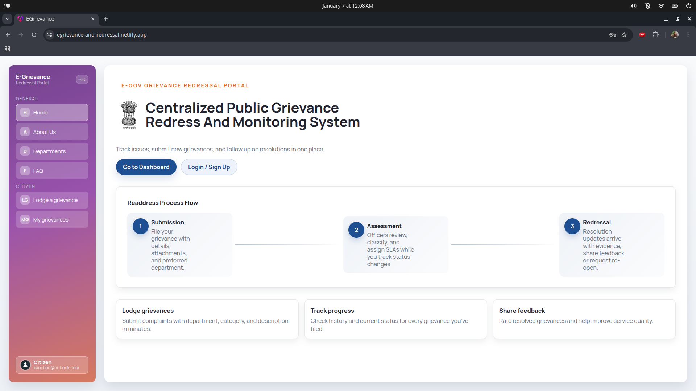
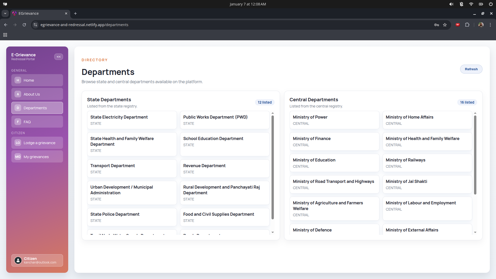
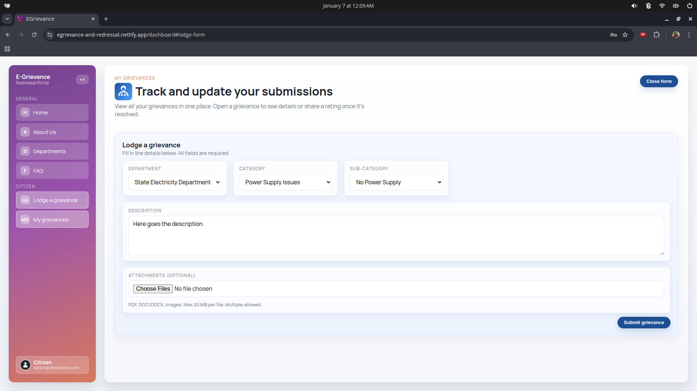
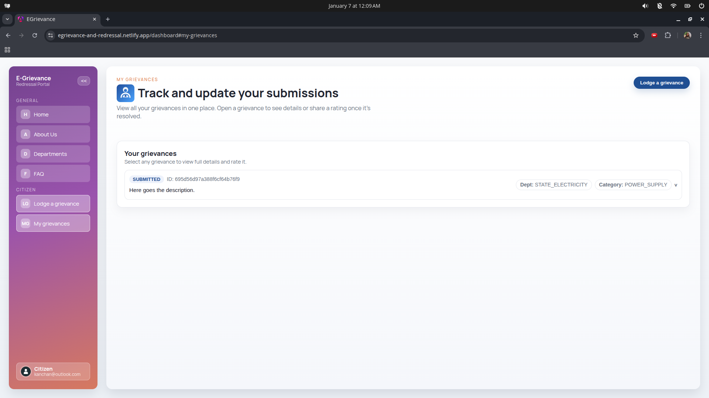

# Centralized Public Grievance Redress And Monitoring System

Track issues, submit new grievances, and follow up on resolutions in one place. Live Demo : [https://egrievance-and-redressal.netlify.app/](https://egrievance-and-redressal.netlify.app/)

## Stack highlights
- Full stack: Angular 21 UI + Spring Boot 3.2.5 Reactive WebFlux services.
- Database: MongoDB for fast, scalable grievance storage.
- Architecture: Microservices with JUnit-tested services for quality.
- CI/CD: Dockerized services, Jenkins pipeline for automated builds/deploys.

## Platform overview
- Roles: Admin, Supervisory Officer, Department Officer, Case Worker, Citizen (JWT-based role access).
- Lifecycle: submitted → assigned → dept_review → in_progress → resolved → closed → escalated.
- Responsibilities: DO/CW investigate and resolve; SO monitors deadlines and escalations; Admin manages departments/users; Citizens submit/track grievances.

## Citizen Usage

  
   
  Figure 1. Homepage

  
   
  Figure 2. Departments

  
   
  Figure 3. Grievance Form

  
   
  Figure 4. Citizen's Grievances

